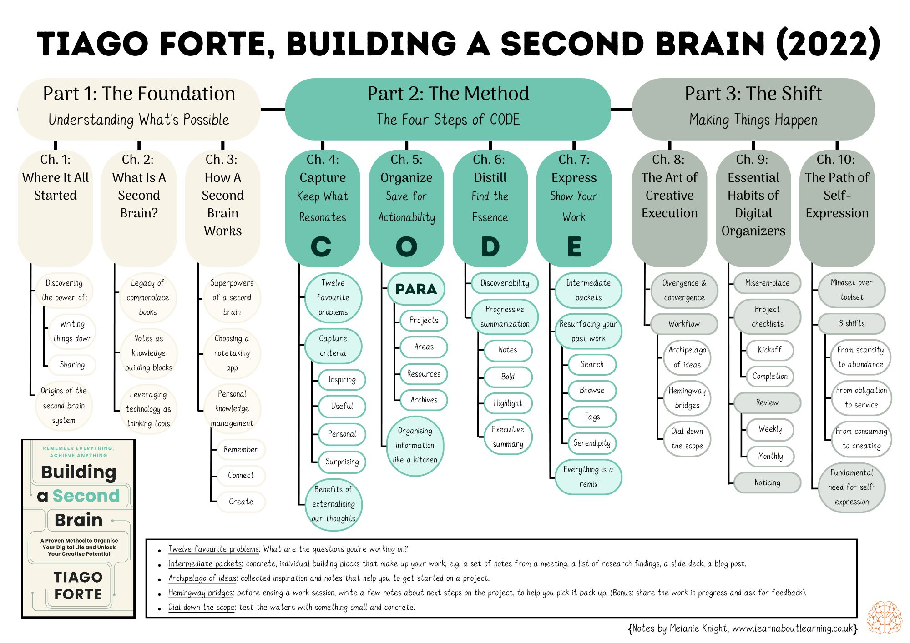

# Progressive Summarization: A Practical Technique for Designing Discoverable Notes - Forte Labs

Metadata

Author: Tiago Forte
Category: article

- Document Note: Progressive Summarization is a note-organizing technique that helps to manage digital information more effectively. The method emphasizes the importance of designing notes for easy discovery and usability by compressing them to only the essential information while including the necessary context. It involves creating small, digestible, and easy-to-read messages, making them valuable to future users. Layer-by-layer enables users to condense information in small quantities, ensuring it remains beneficial to their users in the future.
- URL: [Progressive Summarization a Practical Technique For Designing Discoverable](https://fortelabs.com/blog/progressive-summarization-a-practical-technique-for-designing-discoverable-notes/)

## Highlights

I suggest an alternative to all the approaches above. What you read is good, valuable, and very important, *and you're just reading it at the wrong time*.

The challenge of knowledge is not acquiring it. The challenge is knowing which knowledge is worth acquiring and then building a system to *forward bits of it through time to the future situation, problem, or challenge where it is most applicable and most needed.

At that future point, when you're applying that knowledge directly to a real-world challenge, you won't have to worry about memorizing it, integrating it, or even fully understanding it. You will only have to apply it, and any gaps in your understanding will quickly reveal themselves. By the time you're done solving a real problem with it, book knowledge has become experiential knowledge. And experiential knowledge is something you carry with you forever.

This is the job of a "second brain" — an external, integrated digital repository for the things you learn and the resources from which they come. It is a storage and retrieval system, packaging bits of knowledge into discrete packets that can be forwarded to various points in time to be reviewed, utilized, or deleted.

In [The PARA Method](https://fortelabs.com/blog/para/), I described a universal system for organizing digital information from any source. It is a "good enough" system, maintaining notes according to their *actionability* (which takes just a moment to determine) instead of their *meaning* (which is ambiguous and depends on the context).

There are two primary schools of thought on how to organize a note-taking program (or any body of information, but I'll use terms specific to note-taking apps):

**Tagging-first approaches** argue that no explicit hierarchy of notes, notebooks, and stacks should exist. Notes are envisioned as an ever-changing, virtual matrix of interconnected, free-floating ideas. Because many tags can be applied to one note, there are multiple pathways to discover any given note. Locating notes in specific notebooks and folders is seen as limiting and static.

Although tags have their uses, they don't work as a primary organizational system. In my experience, relying on tagging is too fragile and requires too much maintenance, spreading attention too uniformly across all notes whether or not they are precious.

**Notebook-first**. This translates how we organize things in the physical world — in a series of discrete containers — into the digital world.

Notebook-first is better than tagging-first because it stays out of the way. It doesn't try to automate and encroach upon the deeply intuitive act of making connections and seeing patterns. PARA, on its own, is a notebook-first system.

I propose a way to break the impasse: a **note-first approach**. Let's make the ***design of individual notes*** the primary factor instead of tags or notebooks. This has many advantages:
•   It works well with *any* other **organizational system**, without depending on them (including but not limited to tags and notebooks, if you want to use those)
•   It makes all work you do on your notes **value-added**because you're spending close to 100% of the time engaging directly with the content itself
•   It can more easily **survive** **migrations** to other devices, storage locations, and even programs because note content is much more likely to be preserved than overarching structure
•   It **cultivates** **skills** (succinct communication, finding the core of an idea, visual thinking, etc.) that are inherently valuable and highly transferrable to other activities
•   It makes your notes more **legible and helpful to others** (unlike your internal notebook structure, which is only for your use), promoting collaboration and sharing

A note-first approach to knowledge management means we have to think about design. In a genuine sense, you are designing a product for a demanding customer — Future You.

Future You need to trust that everything Past You put into your notes is valuable. Tomorrow You are impatient and skeptical, demanding proof upfront that the time they spend reviewing notes will be worthwhile.

You've gotta "sell them" on the idea of reviewing a given note, including [all the stages](https://www.thebalance.com/get-to-know-and-use-aida-39273) any salesperson has to master: gaining **Attention**, inspiring **interest**, establishing **credibility**, stoking **desire**, and making a case for **action** NOW.

Let's start at the beginning: at the heart of every design, we are trying to balance priorities. You want one thing, but it has to be balanced against something else that you *also* want.

In the case of notes, we are trying to balance the two priorities are **discoverability** and **understanding**.

Making a note **discoverable** involves making it small, simple, and easy to digest. We accomplish this using **compression:** creating highly condensed summaries without all the fluff.

We also want to make our notes **understandable**. This involves including all the **context**: the details, the examples, and cited sources to be sure everything runs smoothly.

This is a problematic tradeoff because *you can only compress something without losing some of its context*.

In making decisions about what to keep, you are inevitably making decisions about what to throw away.

There's a natural tension between the two, compression and context.

You must summarize the note *without knowing what it will be used for*. It is general-purpose summarization, a more significant challenge than extracting takeaways for just one specific project.

"Progressive Summarization" works in "layers" of summarization.

Layer 0 is the original, full-length source text.

Layer 1 is the content that I initially brought into my note-taking program. I need an explicit set of criteria on what to keep. I capture anything that feels insightful, interesting, or useful.

Layer 2 is the first round of accurate summarization, in which I bold only the best parts of the passages I've imported. I look for keywords, phrases, and sentences representing the discussed idea's core or essence. I will do this bolding layer later when reviewing this note.

For Layer 3, I switched to highlighting to make out the smaller number of highlighted passages among all the bolded ones. This time, I'm looking for the "best of the best," only highlighting something if it is truly unique or valuable.

For Layer 4, I'm still summarizing but going beyond highlighting the words of others to recording my own.

And finally, for a tiny minority of sources, the ones that are so powerful and exciting, I want them to become part of how I think and work *immediately*; I remix them. After pulling them apart and dissecting them from every angle in layers 1–4, I add my personality and creativity and turn them into something else.
